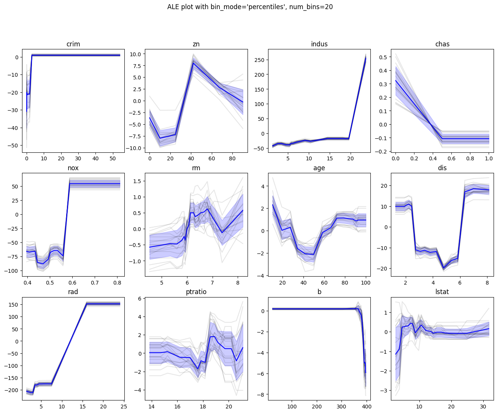
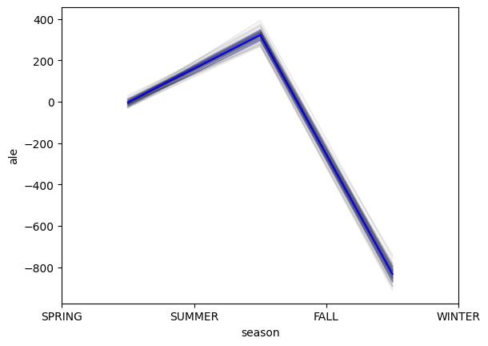
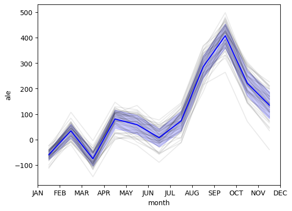
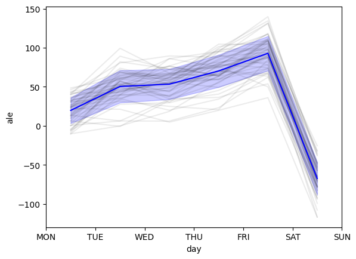
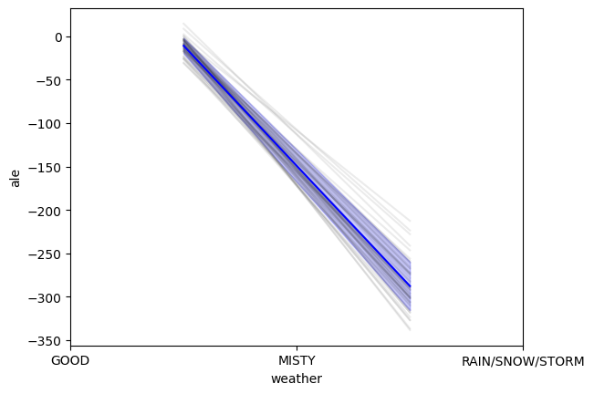
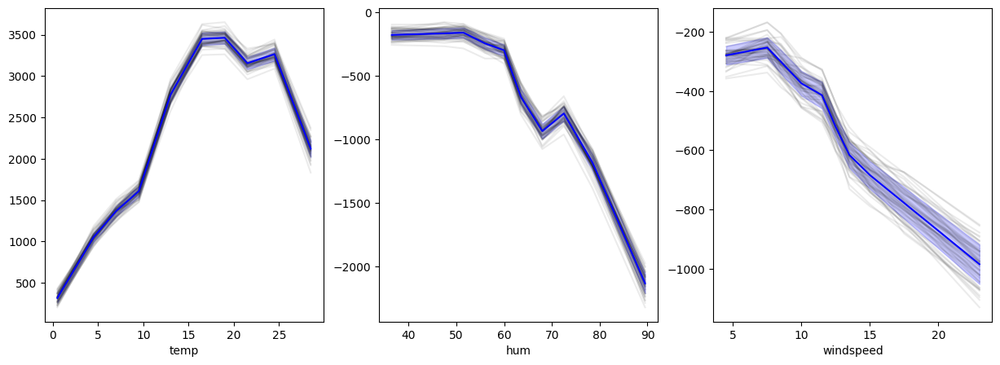
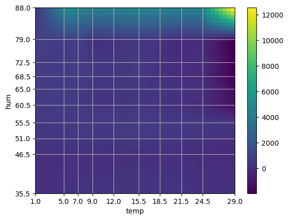

# Accumulated Local Effect (ALE) Plots Repository

## Overview

This repository is part of the "Fair and Interpretable Machine Learning" seminar hosted by [Janek Thomas](https://www.linkedin.com/in/thomasjanek/?originalSubdomain=de) in the summer semester 2022. The primary focus of this codebase is to provide a custom implementation of Accumulated Local Effect (ALE) plots as proposed from Apley, Daniel W. et al. in 2016. [Visualizing the Effects of Predictor Variables in Black Box Supervised Learning Models](https://arxiv.org/pdf/1612.08468.pdf), a popular interpretability technique in machine learning.

## About Accumulated Local Effect (ALE) Plots

Accumulated Local Effect (ALE) plots are a powerful tool for interpreting the impact of individual features on the predictions made by machine learning models. They provide insights into how changes in a particular feature affect the model's output. This repository aims to implement and showcase the generation of ALE plots using out-of-the-box machine learning algorithms from the [scikit-learn](https://scikit-learn.org/stable/) library.

## Limitations

### Application on images

Analyzing ALE plots on images can pose significant challenges due to the complexity of applying the method to each individual pixel. The true interpretation of an image relies on the interplay of nearly every pixel and their arrangement. Moreover, the computational cost is substantial, as it necessitates generating a plot for each pixel or their various combinations.

To address these challenges, I propose employing ALE plots subsequent to the output of a specific kernel. By doing so, we can identify the features the kernel is emphasizing (such as straight lines or circles), allowing us to then apply the ALE plot to determine the extent to which this kernel output contributes to the overall output of the entire neural network. This approach provides a more focused and efficient analysis compared to applying ALE plots directly to individual pixels.

## Usage

To generate ALE plots, the following example code can be used:

```python
models = []
for _ in range(num_models):
    regressor = RandomForestRegressor()

    regressor.fit(X_train, y_train)
    models.append(regressor)

ale = ALE(models, num_bins, centered=True)
scores, bins = ale(X_test, [column_idx])
```

In this code snippet:

- `num_models` represents the number of models to train on the dataset. This is particular interesting with a stochastic training process.
- `X_train` and `y_train` are the training features and labels, respectively.
- `X_test` is the test set for which ALE plots will be generated.
- `[column_idx]` is the list of indices of the features for which the ALE plot will be generated. Supported are at maximum 2 indices.
- `num_bins` specifies the number of bins to be used in the ALE plot.

Adjust these parameters according to your specific dataset and requirements.

## Examples

You will find a brief summary of existing examples. For more details please refer to the example [notebooks](examples/)

### Boston Housing Dataset

ALE on 20 Random-Forest-Regressor. Individual results in grey. Mean ALE in blue with standard deviation in fading blue.



### Bike Rental Dataset

ALE on 50 Random-Forest-Regressor on categorical and continuous features. Individual results in grey. Mean ALE in blue with standard deviation in fading blue.







2D mean ALE depending on temperature and humidity over 20 Random-Forest-Regressor. The heatmap was calculated using a linear interpolation method between the bins. The x and y ticks are the bucket mids. For more information about 2D ALE please refer to original paper. The black dots are samples from the dataset given to the ALE module.


## Checklist of Open Tasks

- [ ] Implement ALE plot generation for multiple features.
- [ ] Optimize ALE plot rendering for large datasets.
- [ ] Implement unit tests for ALE class.
- [x] ALE plots for categorical features.

Feel free to contribute by picking up any open task or suggesting new ones. Contributions are highly appreciated!

## Requirements

Ensure you have the necessary dependencies installed. You can install them using the following:

```bash
pip install -r requirements.txt
```

## Code of Conduct

Please review our [Code of Conduct](CODE_OF_CONDUCT.md) to understand the expectations and guidelines for participating in this project.

## License

This project is licensed under the [Apache 2.0 License](LICENSE). Feel free to use, modify, and distribute the code in accordance with the terms of the license.

## Acknowledgments

Special thanks to Janek Thomas for hosting the "Fair and Interpretable Machine Learning" seminar, which inspired and guided the development of this repository.

If you have any questions or issues, please feel free to open an [issue](https://github.com/RobinU434/AccumulatedLocalEffectPlots/issues). Contributions are welcome!

Happy coding! 🚀

## References

- Apley, Daniel W., and Jingyu Zhu. 2016. [Visualizing the Effects of Predictor Variables in Black Box Supervised Learning Models](https://arxiv.org/abs/1612.08468).
- Molnar, Christoph. 2020. [Interpretable Machine Learning](https://christophm.github.io/interpretable-ml-book/)
- Data-Source: [Boston Housing](https://raw.githubusercontent.com/selva86/datasets/master/BostonHousing.csv)
